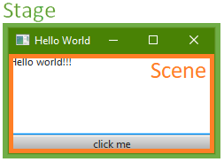

# Allgemeine Informationen
## Stages und Scenes
Jedes Fenster einer Anwendung ist in zwei Teile aufgeteilt. Der Inhalt des Fensters wird Scene genannt. Ein weiterer Teil ist der Rahmen um den Inhalt. Das ist die Stage. Sie beinhaltet ein Icon, den Titel und die Buttons zum minnimieren, maximieren und schließen des Fensters.

## Zugriff auf GUI-Elemente
Die Referenz zu einem GUI-Element kann mithilfe der getUiElement-Funktion der JFXSceneController-Klasse aufgelöst werden. Zu jeder Scene existiert genau ein JFXSceneController. Lediglich dieser JFXSceneController erlaubt den Zugriff auf die Bedienelemente der spezifischen Scene. Damit ein Bedienelement referenziert werden kann, muss ihm in der fxml-Datei ein eindeutiger Identifier zugewiesen sein.

## Veränderungen an GUI-Elementen
Veränderungen an GUI-Elementen (alle Objekte, deren Referenz mithilfe der getUiElement-Methode, der JFXSceneController-Klasse, ermittelt wurden) dürfen nur vom JavaFX-Application-Thread ausgeführt werden. Zum Delegieren von Aufgaben zum JavaFX-Application-Thread sind die Methoden
- pushBackTask,
- applyTasks und
- applyTask

der JFXSceneController-Klasse zu nutzen.

## Fenster schließen
Fenster können standardmäßig über das Kreuz in der linken oberen Ecke geschlossen werden. Des Weiteren können Fenster mithilfe der Funktionen close und forceClose, der JFXSceneController-Klasse, geschlossen werden.

Vorsicht! - Wird forceClose genutzt, so werden die [Bedingungen zum Schließen eines Fensters](../PreCloseCheck/PreCloseCheck.md) <b>nicht</b> ausgewertet.  
