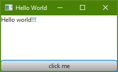
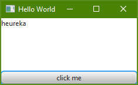

# A first application
Below, you are guided through the development of a simple "Hello world"-application. The result should look like this:



After clicking the button "click me", "Hello world!!!" should be replaced by "heureka".

## Implementing a prototype
At first, we have to create the fxml-file defining the scene.
```xml
<?xml version="1.0" encoding="UTF-8"?>

<?import javafx.scene.control.Button?>
<?import javafx.scene.control.Label?>
<?import javafx.scene.layout.VBox?>

<VBox xmlns="http://javafx.com/javafx/8.0.65" xmlns:fx="http://javafx.com/fxml/1">
   <children>
      <Label alignment="TOP_LEFT" maxHeight="1.7976931348623157E308" maxWidth="1.7976931348623157E308" text="Hello world!!!" VBox.vgrow="ALWAYS" />
      <Button maxWidth="1.7976931348623157E308" mnemonicParsing="false" text="click me" />
   </children>
</VBox>
```
Its content selects and arranges the gui-elements. In this case the scene contains a vertical box which contains a label and a button. The label takes all available space and holds the text "Hello world!!!". The button is below the label and is tied to the bottom of the window. The button takes all available space in horizontal direction. It holds the text "click me".

To create the applicaton, holding the scene, this MATLAB-script is required.  
```MATLAB
% Add required directories to classpath.-----------------------------------

% Get the path to the folder containing this file.
[pathToThisDir, ~, ~] = fileparts(mfilename('fullpath'));
% Add all MATLAB-sources to the class path.
addpath(genpath(pathToThisDir));
% Add MATLAB-library to class path.
addpath(<PATH_TO_THE_JFX4MATLAB_PACKAGE>);
import jfx4matlab.matlab.*;
%--------------------------------------------------------------------------

% Create javaFX-application.
jfxApplication = JFXApplication();

% Create stage.
stageController = JFXStageController(jfxApplication, 'Hello World');
% Create scene
sceneController = JFXSceneController(<PATH_TO_THE_FXML_FILE>);
stageController.showScene(sceneController);
```
It adds the jfx4matlab-package to the path of MATLAB. After that it creates an JFXApplication-object. By instantiating the predefined JFXStageController- and JFXSceneController-classes a stage and a scene are created. The scene is generated by parsing the, above created, fxml-file. Finally the scene is presented on the stage.  

Running the MATLAB-script opens this window.


Till now, clicking the button has no effect. For that the logic has to be implemented.

## Implement the logic
If the button "click me" is clicked, some text should be replaced. To achieve that we have to adapt the fxml-file.
```xml
<?xml version="1.0" encoding="UTF-8"?>

<?import javafx.scene.control.Button?>
<?import javafx.scene.control.Label?>
<?import javafx.scene.layout.VBox?>

<VBox xmlns="http://javafx.com/javafx/8.0.65" xmlns:fx="http://javafx.com/fxml/1" fx:controller="generic_jfx_application.event_transfer.Controller">
  <children>
      <Label fx:id="lbl" alignment="TOP_LEFT" maxHeight="1.7976931348623157E308" maxWidth="1.7976931348623157E308" text="Hello world!!!" VBox.vgrow="ALWAYS" />
      <Button fx:id="btn" maxWidth="1.7976931348623157E308" mnemonicParsing="false" onAction="#handleEvent" text="click me" />
   </children>
</VBox>
```
At first, we define the controller of the scene. Therefore we have to specify a controller in the root-element of the gui-elements. In this case the root-element is the vertical box. As its controller we set "generic_jfx_application.event_transfer.Controller". This allows transmitting events from the scene, to the jfx4matlab-package. After that we can register the "handleEvent" callback on the "onAction" event of the button. Now this event will be transmitted, if it occurs. Finally we assign identifiers to the label and the button. This enables accessing these elements. To handle the events of the scene, we have to implement a JFXSceneController. The JFXSceneController below implements the logic of this example.
```MATLAB
classdef SampleController < jfx4matlab.matlab.JFXSceneController
    %SAMPLECONTROLLER Controller class for the sample scene.

    properties
        lbl; % The label with the name lbl.
        list; % The listView with the name list.
    end

    methods
        function obj = SampleController(fxml)
            obj = obj@jfx4matlab.matlab.JFXSceneController(fxml);
        end

        function initScene(obj)
            obj.lbl = obj.getUiElement('lbl');
            obj.list = obj.getUiElement('list');
        end

        function eventConsumed = handleSceneEvent(obj, e)
            eventConsumed = 0;
            if(strcmp(e.fxId, 'btn')...
                    && strcmp(e.action, 'ACTION'))
                % Handle click on btn.
                obj.applyTask(obj.lbl, 'setText', 'heureka');
                eventConsumed = true;
            end
        end
    end
end
```   
It redefines the "initScene"-function to resolve the gui-elements. By redefining the "handleSceneEvent"-function it handles the incoming events from the assigned scene. The only input-parameter of "handleSceneEvent" is an event. This event contains its source gui-element and its name. By evaluating this data you can process the event. If you expect the incoming event, this function should return true, otherwise a warning will rise. The JFXSceneController above processes the event by changeing the text according to the requirements.

To integrate the defined logic into the sample application, we have to use our derived JFXStageController, instead of the base-class.
```MATLAB
% Add required directories to classpath.-----------------------------------

% Get the path to the folder containing this file.
[pathToThisDir, ~, ~] = fileparts(mfilename('fullpath'));
% Add all MATLAB-sources to the class path.
addpath(genpath(pathToThisDir));
% Add MATLAB-library to class path.
addpath(<PATH_TO_THE_JFX4MATLAB_PACKAGE>);
import jfx4matlab.matlab.*;
%--------------------------------------------------------------------------

% Create javaFX-application.
jfxApplication = JFXApplication();

% Create stage.
stageController = JFXStageController(jfxApplication, 'Hello World');
% Create scene
% Replace the following line of code.
% sceneController = JFXSceneController(<PATH_TO_THE_FXML_FILE>);
sceneController = SampleController(<PATH_TO_THE_FXML_FILE>);
stageController.showScene(sceneController);
```

Finally, pressing the button is acknowledged by changing the text.    



The sources of this example are available [here](../../samples/HelloWorld). To run the example you have to check out the whole repository! The structure of the folders must not be changed!
