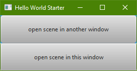
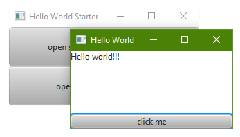
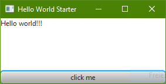

# Use multiple scenes
The most applications consist of more than one scene. Often one start page refers to multiple sub-scenes. Therefore a new scene replaces the start page or is displayed in an additional window. Both cases are included in the example below.    

This example is based on the [Hello World application](../../samples/HelloWorld). It extends this application by adding a start page. The start page allows to choose, if the scene from the [Hello World application](../../samples/HelloWorld) should be shown in a additional or the existing window.

At first, we have to create the fxml-file of the start page.
```xml
<?xml version="1.0" encoding="UTF-8"?>

<?import javafx.scene.control.Button?>
<?import javafx.scene.layout.VBox?>

<VBox xmlns="http://javafx.com/javafx/8.0.65" xmlns:fx="http://javafx.com/fxml/1" fx:controller="generic_jfx_application.event_transfer.Controller">
   <children>
      <Button fx:id="btn_openInOtherWindow" maxHeight="1.7976931348623157E308" maxWidth="1.7976931348623157E308" mnemonicParsing="false" onAction="#handleEvent" text="open scene in another window" VBox.vgrow="ALWAYS" />
      <Button fx:id="btn_openInThisWindow" maxHeight="1.7976931348623157E308" maxWidth="1.7976931348623157E308" mnemonicParsing="false" onAction="#handleEvent" text="open scene in this window" VBox.vgrow="ALWAYS" />
   </children>
</VBox>
```
The file defines two buttons. Each of them got an identifier and a text. The "onAction"-event of both buttons are transmitted to the jfx4matlab-package. The following JFXSceneController processes the events.
```MATLAB
classdef StarterController < jfx4matlab.matlab.JFXSceneController
    %STARTERCONTROLLER Controller class for the starter scene.

    methods
        function obj = StarterController(fxml)
            obj = obj@jfx4matlab.matlab.JFXSceneController(fxml);
        end

        function eventConsumed = handleSceneEvent(obj, e)
            eventConsumed = 0;

            % Determine path to sample.fxml
            [pathToThisDir, ~, ~] = fileparts(mfilename('fullpath'));
            pathToFxml = fullfile(pathToThisDir, 'sample.fxml');

            if(strcmp(e.fxId, 'btn_openInOtherWindow')...
                    && strcmp(e.action, 'ACTION'))
                obj.openSampleInOtherWindow(pathToFxml);
                eventConsumed = 1;
            elseif(strcmp(e.fxId, 'btn_openInThisWindow')...
                    && strcmp(e.action, 'ACTION'))
                obj.openSampleInThisWindow(pathToFxml);
                eventConsumed = 1;
            end
        end

        function openSampleInOtherWindow(obj, pathToFxml)
            % Create stage
            stageController = jfx4matlab.matlab.JFXStageController(...
                obj.getJfxApplication(), 'Hello World');
            % Create scene
            sceneController = SampleController(pathToFxml);
            stageController.showScene(sceneController);
        end

        function openSampleInThisWindow(obj, pathToFxml)
            % Create scene
            sceneController = SampleController(pathToFxml);
            obj.getStageController().showScene(sceneController);
        end
    end
end
```
The function "openSampleInOtherWindow" creates a new window and displays the scene from the [Hello World application](../../samples/HelloWorld) there. The function "openSampleInThisWindow" displays the scene in the window of the start page. Therefore it shows the scene on the stage of the start page.

Finally we have to modify the MATLAB-script.
```Matlab
% Add required directories to classpath.-----------------------------------

% Get the path to the folder containing this file.
[pathToThisDir, ~, ~] = fileparts(mfilename('fullpath'));
% Add all MATLAB-sources to the class path.
addpath(genpath(pathToThisDir));
% Add MATLAB-library to class path.
jfx4matlabPath = fullfile(pathToThisDir, '..', '..');
addpath(jfx4matlabPath);
import jfx4matlab.matlab.*;
%--------------------------------------------------------------------------

% Get the path to the fxml.
pathToFxml = fullfile(pathToThisDir, 'starter.fxml');

% Create javaFX-application.
jfxApplication = JFXApplication();

% Create stage. Change the title to indicate the use different windows.
stageController = JFXStageController(jfxApplication, 'Hello World Starter');
% Create scene
% sceneController = SampleController(pathToFxml);
sceneController = StarterController(pathToFxml);
stageController.showScene(sceneController);
```
Instead of showing the scene from the [Hello World application](../../samples/HelloWorld) the start page should be shown.

Running the MATLAB-script opens this window.



Clicking the button "open scene in another window" opens one more window containing the scene of the [Hello World application](../../samples/HelloWorld).



A click on the button "open scene in this window" replaces the start page scene, with the scene of the [Hello World application](../../samples/HelloWorld).



The sources of this example are available [here](../../samples/MultipleScenes). To run the example, you have to check out the whole repository! The structure of the folders must not be changed!
