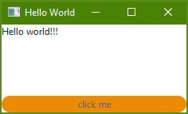

# Change the style of the gui
The jfx4matlab-package is based on javaFX. JavaFX allows customizing scenes by applying css-files. This section tries to give an insight on how you can do this.  

The example below is based on the [Hello World application](../../samples/HelloWorld). In the following we change the shape and color of the button.  

## Create a css-file
At first, we have to create an appropriate css-file.
```css
.button {
		-fx-background-color: #ed8b00;
    -fx-text-fill: #63666a;
    -fx-background-radius: 30;
    -fx-background-insets: 0;
}
```
This file selects all buttons and changes the color of their text to grey and the background to orange. Likewise the buttons are rounded off. A more detailed description, on how to costumize ui-elements, can be found at the [javaFX reference page](https://docs.oracle.com/javafx/2/css_tutorial/jfxpub-css_tutorial.htm). (Watch out, if you follow the instructions on the [javaFX reference page](https://docs.oracle.com/javafx/2/css_tutorial/jfxpub-css_tutorial.htm). You should not link the css-file and the scene by java-code. Instead you have to specify the css- in the fxml-file of the scene. For further information on how to specify the css- in the fxml-file, see the section "Tie css-file to scene".)

## Tie css-file to scene
To ensure that the css-file is considered while parsing the scene, you have to tie it to the fxml-file.
```xml
<?xml version="1.0" encoding="UTF-8"?>

<?import java.net.URL?>
<?import javafx.scene.control.Button?>
<?import javafx.scene.control.Label?>
<?import javafx.scene.layout.VBox?>

<VBox xmlns="http://javafx.com/javafx/8.0.65" xmlns:fx="http://javafx.com/fxml/1" fx:controller="generic_jfx_application.event_transfer.Controller">
   <stylesheets>
      <URL value="<PATH_TO_THE_CSS_FILE>" />
   </stylesheets>
   <children>
      <Label fx:id="lbl" alignment="TOP_LEFT" maxHeight="1.7976931348623157E308" maxWidth="1.7976931348623157E308" text="Hello world!!!" VBox.vgrow="ALWAYS" />
      <Button fx:id="btn" maxWidth="1.7976931348623157E308" mnemonicParsing="false" onAction="#handleEvent" text="click me" />
   </children>
</VBox>
```
Therefore the css-file has to be mentioned in the definition of the root-element of the gui-elements. To use the URL-tag you also have to import the "java.net.URL-package".

Starting the applicaton displays this window.



The sources of this example are available [here](../../samples/StyleGui). To run the example you have to check out the whole repository! The structure of the folders must not be changed!
