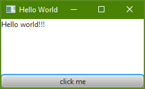

# Gestalten der Benutzeroberfläche
Dem jfx4matlab-Package liegt JavaFX zugrunde. JavaFX erlaubt das individuelle Gestalten von Scenes mithilfe von css-Dateien. Dieser Abschnitt versucht anhand eines kleinen Beispiels die grundlegenden Schritte zum stylen einer Scene zu veranschaulichen. Weiterführende Informationen bezüglich dem Anwenden von css-Dateien sind der [JavaFX-Referenz](https://docs.oracle.com/javafx/2/get_started/css.htm ) zu entnehmen. Beim sichten dieser Dokumente gilt es jedoch darauf zu achten, dass die css-Dateien nicht durch Java-Code mit der Scene verknüft werden können. Stattdessen müssen die css-Dateien entsprechend des Abschnitts "css-Datei in fxml-Datei referenzieren" in den jeweiligen fxml-Dateien referenziert werden.

Dieses Beispiel basiert auf der  [Hello World Anwendung](../../samples/HelloWorld). Wird sie gestartet, öffnet sich dieses Fenster.


Ziel ist es nun die Form und Farbe des Buttons zu verändern.

## css-Datei erzeugen
Zuerst muss eine ensprechende css-Datei geschrieben werden.
```css
.button {
	-fx-background-color: #ed8b00;
    -fx-text-fill: #63666a;
    -fx-background-radius: 30;
    -fx-background-insets: 0;
}
```
Sie ändert die Hintergrundfarbe eines Buttons zu orange und die Textfarbe zu grau. Ebenso rundet sie den Button ab.

## css-Datei in fxml-Datei referenzieren
Damit die css-Datei beim generieren der Scene berücksichtigt wird muss es im fxml verknüpft werden.
```xml
<?xml version="1.0" encoding="UTF-8"?>

<?import java.net.URL?>
<?import javafx.scene.control.Button?>
<?import javafx.scene.control.Label?>
<?import javafx.scene.layout.VBox?>

<VBox xmlns="http://javafx.com/javafx/8.0.65" xmlns:fx="http://javafx.com/fxml/1" fx:controller="generic_jfx_application.event_transfer.Controller">
   <stylesheets>
      <URL value="<PATH_TO_THE_CSS_FILE>" />
   </stylesheets>
   <children>
      <Label fx:id="lbl" alignment="TOP_LEFT" maxHeight="1.7976931348623157E308" maxWidth="1.7976931348623157E308" text="Hello world!!!" VBox.vgrow="ALWAYS" />
      <Button fx:id="btn" maxWidth="1.7976931348623157E308" mnemonicParsing="false" onAction="#handleEvent" text="click me" />
   </children>
</VBox>
```
Dazu muss die stylesheets-Eigenschaft des root-Elements der Bedienelemente angepasst werden. Hier muss der Pfad zum css vermerkt werden. Damit das URL-Tag genutzt werden kann muss zusätlich URL aus dem java.net-Package importiert werden.

Wird die Beispielanwendung gestartet, so erwartet uns dieses Fenster.


Der Sourcecode dieses Beispiels befindet sich in [diesem Ordner](../../samples/StyleGui). Zum Ausführen des Beispiels muss das gesamte Repository ausgecheckt werden! Die Ordnerstruktur darf nicht verändert werden!
